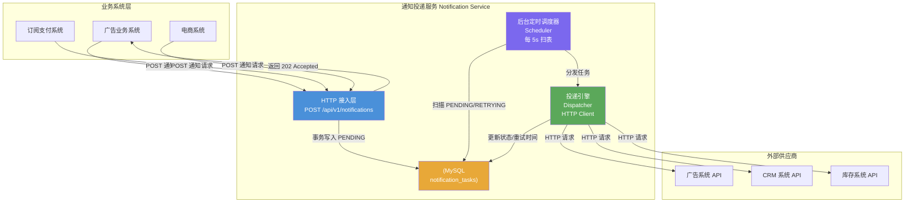
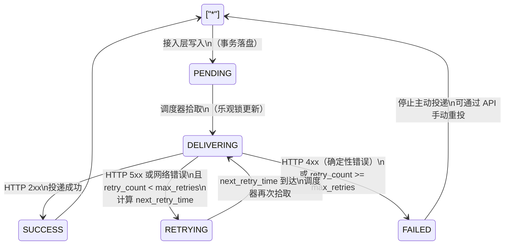
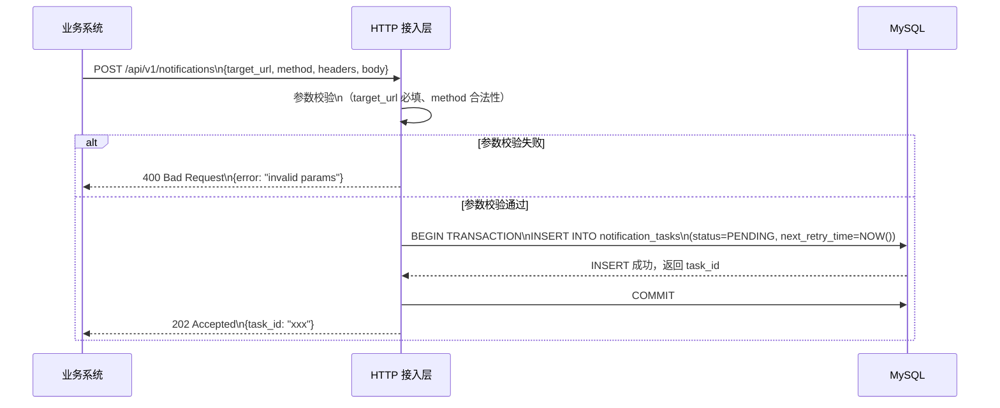
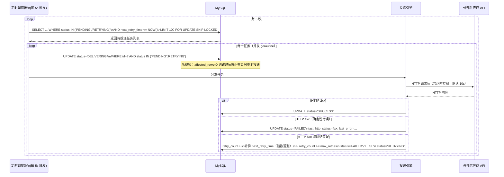
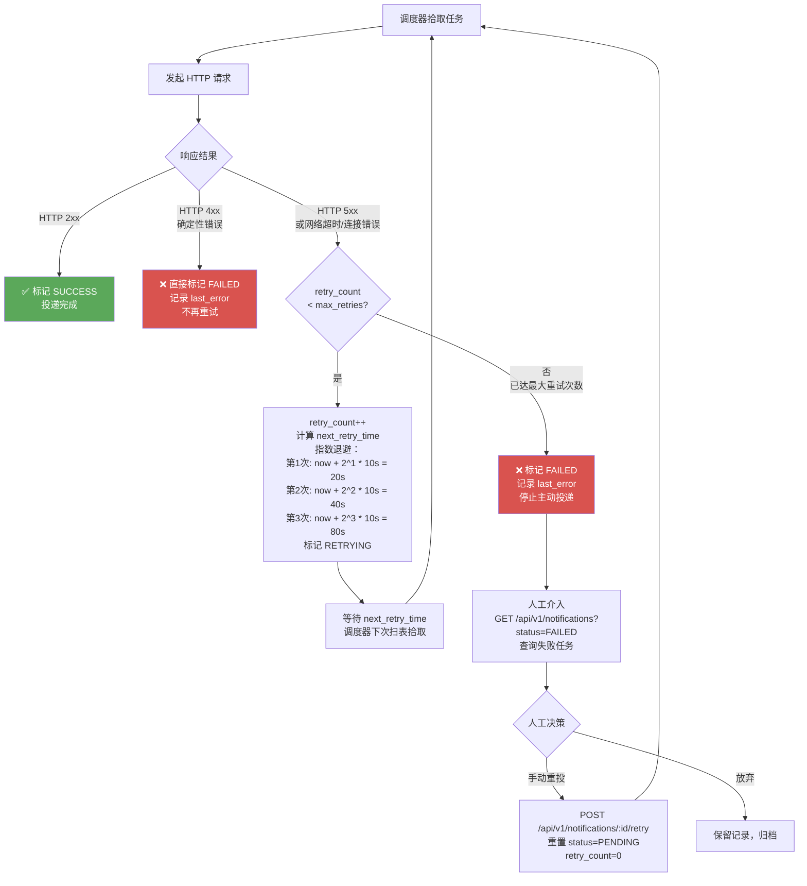
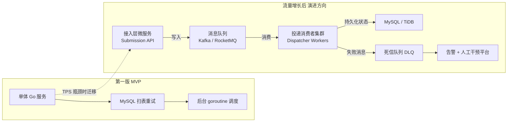

# 内部实现设计文档：可靠外部 HTTP 通知投递服务

**版本**：v1.0（MVP）
**技术栈**：Go + MySQL
**更新时间**：2026-03-09

---

## 目录

1. ["系统概述"](#1-系统概述)
2. ["系统边界"](#2-系统边界)
3. ["整体架构图"](#3-整体架构图)
4. ["核心数据模型（表结构）"](#4-核心数据模型表结构)
5. ["任务状态机"](#5-任务状态机)
6. ["核心流程设计"](#6-核心流程设计)
   - 6.1 ["接收通知请求（接入层）"](#61-接收通知请求接入层)
   - 6.2 ["后台投递引擎（Dispatcher）"](#62-后台投递引擎dispatcher)
   - 6.3 ["重试与失败处理流程"](#63-重试与失败处理流程)
7. ["可靠性设计"](#7-可靠性设计)
8. ["Go 包结构"](#8-go-包结构)
9. ["关键代码骨架"](#9-关键代码骨架)
10. ["架构演进路线"](#10-架构演进路线)
11. ["被拒绝的设计决策"](#11-被拒绝的设计决策)

---

## 1. 系统概述

本服务是一个**内部可靠通知投递中间件**，接收企业内部业务系统提交的外部 HTTP 通知请求，并以 **At-Least-Once（至少一次）** 语义将其可靠地投递到目标外部供应商 API。

**核心设计原则**：
- **发件箱模式（Outbox Pattern）**：请求接入时开启本地事务直接落盘，保证不丢失
- **单一存储依赖**：MVP 阶段仅依赖 MySQL，无需引入 Redis 等额外中间件
- **后台定时扫表**：通过定时任务扫描 `PENDING` / `RETRYING` 状态记录进行投递
- **指数退避重试**：最大重试 3 次，超出后标记为 `FAILED`，停止主动投递

---

## 2. 系统边界

### ✅ 系统内解决的问题

| 问题 | 处理方式 |
|------|---------|
| 网络级别故障（超时、连接重置） | 捕获错误，触发重试 |
| 外部服务临时故障（HTTP 5xx） | 视为可重试错误，按指数退避重试 |
| 服务进程崩溃后的任务恢复 | 任务持久化在 DB，重启后继续扫表投递 |
| 投递结果可查询 | 主表记录 `last_error`、`retry_count`、`status` |
| 人工补偿入口 | 提供 API 查询 `FAILED` 任务并手动触发重投 |

### ❌ 系统明确不解决的问题

| 问题 | 不解决的原因 |
|------|------------|
| 上游业务系统的鉴权 | 默认由内网 API 网关统一处理，本服务不重复建设 |
| 外部系统的业务错误（HTTP 4xx） | 属于确定性错误（参数错误/权限问题），重试无意义，直接标记 `FAILED` |
| Exactly-Once 精确一次投递 | 需要外部供应商配合实现幂等，本服务不强制保证 |
| 外部 API 的返回值处理 | 业务系统不关心返回值，本服务仅记录用于排查 |
| 消息顺序保证 | MVP 阶段不保证同一目标的消息有序投递 |

---

## 3. 整体架构图



---

## 4. 核心数据模型（表结构）

MVP 阶段仅使用**单张主表**，避免引入关联写入操作。

### `notification_tasks` 表

```sql
CREATE TABLE notification_tasks (
    id              BIGINT UNSIGNED NOT NULL AUTO_INCREMENT COMMENT '主键',
    
    -- 投递目标信息
    target_url      VARCHAR(2048)   NOT NULL COMMENT '目标 HTTP(S) 地址',
    http_method     VARCHAR(10)     NOT NULL DEFAULT 'POST' COMMENT '请求方法：POST/PUT/PATCH',
    headers         JSON            COMMENT '自定义请求头，JSON 对象格式',
    body            MEDIUMTEXT      COMMENT '请求体内容（原始字符串）',
    
    -- 任务状态
    status          VARCHAR(20)     NOT NULL DEFAULT 'PENDING'
                    COMMENT '状态：PENDING/DELIVERING/SUCCESS/RETRYING/FAILED',
    
    -- 重试控制
    retry_count     INT UNSIGNED    NOT NULL DEFAULT 0 COMMENT '已重试次数',
    max_retries     INT UNSIGNED    NOT NULL DEFAULT 3 COMMENT '最大重试次数',
    next_retry_time DATETIME        COMMENT '下次允许重试的时间（指数退避计算）',
    
    -- 错误记录
    last_http_status INT            COMMENT '最近一次投递的 HTTP 状态码',
    last_error      TEXT            COMMENT '最近一次失败的错误信息',
    
    -- 溯源信息
    source_system   VARCHAR(100)    COMMENT '来源业务系统标识，便于排查',
    trace_id        VARCHAR(64)     COMMENT '业务链路追踪 ID',
    
    -- 时间戳
    created_at      DATETIME        NOT NULL DEFAULT CURRENT_TIMESTAMP COMMENT '创建时间',
    updated_at      DATETIME        NOT NULL DEFAULT CURRENT_TIMESTAMP
                    ON UPDATE CURRENT_TIMESTAMP COMMENT '最后更新时间',
    
    PRIMARY KEY (id),
    INDEX idx_status_next_retry (status, next_retry_time) COMMENT '调度器扫表核心索引',
    INDEX idx_created_at (created_at)                     COMMENT '按时间查询索引'
) ENGINE=InnoDB DEFAULT CHARSET=utf8mb4 COMMENT='外部 HTTP 通知任务表';
```

**字段设计说明**：

| 字段 | 设计意图 |
|------|---------|
| `status + next_retry_time` 联合索引 | 调度器扫表的核心查询条件，避免全表扫描 |
| `headers` 使用 JSON 类型 | 不同供应商 Header 格式各异，JSON 存储最灵活 |
| `last_error` | 直接记录在主表，避免引入独立日志表的关联写入 |
| `source_system` | 便于按业务系统维度排查问题，无需额外关联 |
| `max_retries` 可配置 | 不同业务场景可设置不同的重试上限 |

---

## 5. 任务状态机



**状态说明**：

| 状态 | 含义 |
|------|------|
| `PENDING` | 已接收，等待首次投递 |
| `DELIVERING` | 正在投递中（防止并发重复投递） |
| `SUCCESS` | 投递成功（HTTP 2xx） |
| `RETRYING` | 投递失败，等待下次重试 |
| `FAILED` | 最终失败，停止主动投递 |

---

## 6. 核心流程设计

### 6.1 接收通知请求（接入层）



**设计要点**：
- 接入层**只负责落盘**，不发起任何 HTTP 请求，响应极快
- 返回 `202 Accepted` 而非 `200 OK`，语义上表示"已接受，异步处理"
- 事务保证：写入成功即不丢失，进程崩溃后重启仍可继续投递

---

### 6.2 后台投递引擎（Dispatcher）



**关键设计**：
- `FOR UPDATE SKIP LOCKED`：多实例部署时，跳过已被其他实例锁定的行，天然防止重复投递
- 乐观锁二次确认：`UPDATE ... WHERE status IN ('PENDING','RETRYING')` 的 `affected_rows` 为 0 时跳过，防止并发竞争
- 每批限制 100 条，避免单次扫表压力过大

---

### 6.3 重试与失败处理流程



**指数退避计算公式**：

```
next_retry_time = NOW() + 2^retry_count * base_interval
```

| 重试次数 | 等待时间（base=10s） |
|---------|-------------------|
| 第 1 次 | 20s（2¹ × 10s） |
| 第 2 次 | 40s（2² × 10s） |
| 第 3 次 | 80s（2³ × 10s） |
| 超过 3 次 | 标记 FAILED |

---

## 7. 可靠性设计

### 7.1 投递语义

采用 **At-Least-Once（至少一次）** 语义：

- **保证**：只要任务未达到 `SUCCESS` 或 `FAILED` 终态，系统会持续尝试投递
- **代价**：极端情况下（如投递成功但更新 DB 前进程崩溃），可能重复投递
- **应对**：要求外部供应商 API 实现幂等（通过 `trace_id` 字段传递去重键）

### 7.2 进程崩溃恢复

- 进程重启后，调度器扫表会发现处于 `DELIVERING` 状态的"僵尸任务"
- 需要一个**超时恢复机制**：扫描 `status='DELIVERING'` 且 `updated_at < NOW() - 60s` 的任务，将其重置为 `RETRYING`

```sql
-- 僵尸任务恢复（随调度器一同执行）
UPDATE notification_tasks
SET status = 'RETRYING', next_retry_time = NOW()
WHERE status = 'DELIVERING'
  AND updated_at < DATE_SUB(NOW(), INTERVAL 60 SECOND);
```

### 7.3 HTTP 客户端配置

```go
// 超时控制，防止慢响应拖垮调度器
httpClient := &http.Client{
    Timeout: 10 * time.Second,
    Transport: &http.Transport{
        MaxIdleConns:        100,
        MaxIdleConnsPerHost: 10,
        IdleConnTimeout:     90 * time.Second,
    },
}
```

---

## 8. Go 包结构

```
notification-service/
├── cmd/
│   └── server/
│       └── main.go                 # 程序入口，初始化并启动服务
├── internal/
│   ├── api/
│   │   ├── handler.go              # HTTP Handler：接收通知请求、手动重投接口
│   │   └── router.go               # 路由注册
│   ├── model/
│   │   └── task.go                 # NotificationTask 结构体定义、状态常量
│   ├── repository/
│   │   └── task_repo.go            # DB 操作封装：Create、UpdateStatus、FetchPending 等
│   ├── scheduler/
│   │   └── scheduler.go            # 定时调度器：定期扫表、分发任务、恢复僵尸任务
│   ├── dispatcher/
│   │   └── dispatcher.go           # 投递引擎：发起 HTTP 请求、处理响应、计算重试
│   └── config/
│       └── config.go               # 配置加载（DB DSN、调度间隔、重试参数等）
├── migrations/
│   └── 001_create_notification_tasks.sql  # 建表 SQL
├── go.mod
├── go.sum
└── README.md
```

---

## 9. 关键代码骨架

### 9.1 任务模型（`internal/model/task.go`）

```go
package model

import "time"

// 任务状态常量
const (
    StatusPending    = "PENDING"
    StatusDelivering = "DELIVERING"
    StatusSuccess    = "SUCCESS"
    StatusRetrying   = "RETRYING"
    StatusFailed     = "FAILED"
)

// NotificationTask 对应 notification_tasks 表
type NotificationTask struct {
    ID             int64      `db:"id"`
    TargetURL      string     `db:"target_url"`
    HTTPMethod     string     `db:"http_method"`
    Headers        string     `db:"headers"`         // JSON 字符串
    Body           string     `db:"body"`
    Status         string     `db:"status"`
    RetryCount     int        `db:"retry_count"`
    MaxRetries     int        `db:"max_retries"`
    NextRetryTime  *time.Time `db:"next_retry_time"`
    LastHTTPStatus *int       `db:"last_http_status"`
    LastError      string     `db:"last_error"`
    SourceSystem   string     `db:"source_system"`
    TraceID        string     `db:"trace_id"`
    CreatedAt      time.Time  `db:"created_at"`
    UpdatedAt      time.Time  `db:"updated_at"`
}
```

### 9.2 接入层 Handler（`internal/api/handler.go`）

```go
package api

// SubmitRequest 业务系统提交的通知请求
type SubmitRequest struct {
    TargetURL    string            `json:"target_url" binding:"required,url"`
    HTTPMethod   string            `json:"http_method" binding:"required,oneof=POST PUT PATCH"`
    Headers      map["string"]string `json:"headers"`
    Body         string            `json:"body"`
    SourceSystem string            `json:"source_system"`
    TraceID      string            `json:"trace_id"`
}

// Submit 接收通知请求，事务落盘后返回 202
func (h *Handler) Submit(c *gin.Context) {
    var req SubmitRequest
    if err := c.ShouldBindJSON(&req); err != nil {
        c.JSON(http.StatusBadRequest, gin.H{"error": err.Error()})
        return
    }

    task, err := h.repo.Create(c.Request.Context(), req)
    if err != nil {
        c.JSON(http.StatusInternalServerError, gin.H{"error": "failed to save task"})
        return
    }

    // 202 Accepted：已接受，异步处理
    c.JSON(http.StatusAccepted, gin.H{"task_id": task.ID})
}

// ManualRetry 手动重投 FAILED 任务
func (h *Handler) ManualRetry(c *gin.Context) {
    taskID := c.Param("id")
    err := h.repo.ResetToRetry(c.Request.Context(), taskID)
    if err != nil {
        c.JSON(http.StatusInternalServerError, gin.H{"error": err.Error()})
        return
    }
    c.JSON(http.StatusOK, gin.H{"message": "task reset to PENDING"})
}
```

### 9.3 调度器（`internal/scheduler/scheduler.go`）

```go
package scheduler

// Start 启动定时调度器
func (s *Scheduler) Start(ctx context.Context) {
    ticker := time.NewTicker(s.cfg.ScanInterval) // 默认 5s
    defer ticker.Stop()

    for {
        select {
        case <-ctx.Done():
            return
        case <-ticker.C:
            s.recoverStuckTasks(ctx)  // 先恢复僵尸任务
            s.dispatchPending(ctx)    // 再投递待处理任务
        }
    }
}

// dispatchPending 扫描并投递 PENDING/RETRYING 任务
func (s *Scheduler) dispatchPending(ctx context.Context) {
    tasks, err := s.repo.FetchPending(ctx, 100)
    if err != nil {
        log.Errorf("fetch pending tasks error: %v", err)
        return
    }

    var wg sync.WaitGroup
    // 使用信号量控制并发数，避免瞬间打满 DB 连接
    sem := make(chan struct{}, s.cfg.MaxConcurrency) // 默认 10

    for _, task := range tasks {
        wg.Add(1)
        sem <- struct{}{}
        go func(t model.NotificationTask) {
            defer wg.Done()
            defer func() { <-sem }()
            s.dispatcher.Deliver(ctx, t)
        }(task)
    }
    wg.Wait()
}
```

### 9.4 投递引擎（`internal/dispatcher/dispatcher.go`）

```go
package dispatcher

// Deliver 执行单次 HTTP 投递，并根据结果更新任务状态
func (d *Dispatcher) Deliver(ctx context.Context, task model.NotificationTask) {
    // 乐观锁：将状态从 PENDING/RETRYING 更新为 DELIVERING
    // affected_rows = 0 说明已被其他实例抢占，直接跳过
    affected, err := d.repo.LockForDelivery(ctx, task.ID)
    if err != nil || affected == 0 {
        return
    }

    resp, err := d.doHTTPRequest(task)

    if err != nil {
        // 网络错误：可重试
        d.handleRetry(ctx, task, 0, err.Error())
        return
    }
    defer resp.Body.Close()

    switch {
    case resp.StatusCode >= 200 && resp.StatusCode < 300:
        // 成功
        d.repo.UpdateStatus(ctx, task.ID, model.StatusSuccess, resp.StatusCode, "")

    case resp.StatusCode >= 400 && resp.StatusCode < 500:
        // 4xx：确定性错误，直接 FAILED，不重试
        d.repo.UpdateStatus(ctx, task.ID, model.StatusFailed, resp.StatusCode,
            fmt.Sprintf("non-retryable error: HTTP %d", resp.StatusCode))

    default:
        // 5xx：临时错误，触发重试
        d.handleRetry(ctx, task, resp.StatusCode,
            fmt.Sprintf("server error: HTTP %d", resp.StatusCode))
    }
}

// handleRetry 计算指数退避时间并更新状态
func (d *Dispatcher) handleRetry(ctx context.Context, task model.NotificationTask, httpStatus int, errMsg string) {
    nextRetryCount := task.RetryCount + 1

    if nextRetryCount >= task.MaxRetries {
        // 超过最大重试次数，标记 FAILED
        d.repo.MarkFailed(ctx, task.ID, httpStatus, errMsg)
        return
    }

    // 指数退避：2^retryCount * baseInterval
    backoff := time.Duration(math.Pow(2, float64(nextRetryCount))) * d.cfg.BaseRetryInterval
    nextRetryTime := time.Now().Add(backoff)

    d.repo.MarkRetrying(ctx, task.ID, nextRetryCount, nextRetryTime, httpStatus, errMsg)
}
```

---

## 10. 架构演进路线



**演进触发条件与策略**：

| 阶段 | 触发条件 | 演进动作 |
|------|---------|---------|
| MVP | 日通知量 < 10 万 | 单体服务 + MySQL 扫表，运维成本最低 |
| 成长期 | 扫表延迟 > 1s 或 DB CPU > 70% | 引入 Redis ZSET 延迟队列，减少 DB 扫表压力 |
| 规模期 | 日通知量 > 1000 万 | 引入 Kafka/RocketMQ，接入层与投递层彻底解耦为独立微服务 |
| 成熟期 | 多地域部署需求 | 引入 DLQ 死信队列 + 告警平台，支持自动化运维 |

---

## 11. 被拒绝的设计决策

以下设计在 AI 初始方案中被提出，但经 Tech Lead 评审后**明确拒绝**，原因如下：

| 被拒绝的设计 | 拒绝原因 |
|------------|---------|
| **引入 Redis 作为队列** | MVP 阶段同时维护 DB + Redis 带来双写一致性问题和额外运维成本，收益不足以覆盖成本 |
| **独立的 `notification_logs` 日志表** | 增加关联写入操作，MVP 阶段直接在主表增加 `last_error`、`retry_count` 字段即可满足排查需求 |
| **消息队列（Kafka/RocketMQ）** | 重型中间件引入门槛高，MVP 阶段扫表方案完全够用，待流量增长后再演进 |
| **独立的死信队列服务** | 过度设计，MVP 阶段 `FAILED` 状态 + 人工 API 查询已足够，无需独立 DLQ 服务 |
